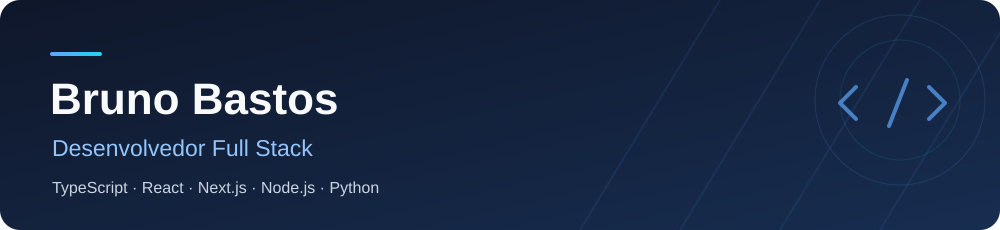

  

<h1 align="center">Bruno Bastos</h1>

<strong>Desenvolvedor Full Stack</strong>

  

Sou desenvolvedor Full Stack e estudante de Engenharia de Software. Trabalho com TypeScript, JavaScript, Python e SQL no desenvolvimento de aplicações web, APIs e automações.

Minha trajetória em desenvolvimento começou no planejamento industrial, criando scripts para processar documentos, conferir dados e gerar relatórios. Hoje atuo como Engenheiro de Software na FrameAI.

### Tecnologias

  <picture>
    <source media="(prefers-color-scheme: dark)" srcset="https://skillicons.dev/icons?i=ts%2Cjs%2Cpython%2Creact%2Cnextjs&theme=dark" />
    
  </picture>
   
  <picture>
    <source media="(prefers-color-scheme: dark)" srcset="https://skillicons.dev/icons?i=nodejs%2Cpostgres%2Credis%2Cgit&theme=dark" />
    
  </picture>

**Linguagens:** TypeScript, JavaScript, Python e SQL.  
**Web e APIs:** React, Next.js, Node.js e Fastify.  
**Dados e ferramentas:** PostgreSQL, Redis e Git.

### Atividade no GitHub

<picture>
  <source media="(prefers-color-scheme: dark)" srcset="./profile/stats-dark.svg" />
  
</picture>

Dados públicos do GitHub. Atualização diária.

### Contato

[linkedin.com/in/brunodevs](https://www.linkedin.com/in/brunodevs/)

<!-- Recursos visuais: github.com/tandpfun/skill-icons, github.com/DenverCoder1/readme-typing-svg, shields.io. Estatísticas: github.com/stats-organization/github-readme-stats-action. -->

